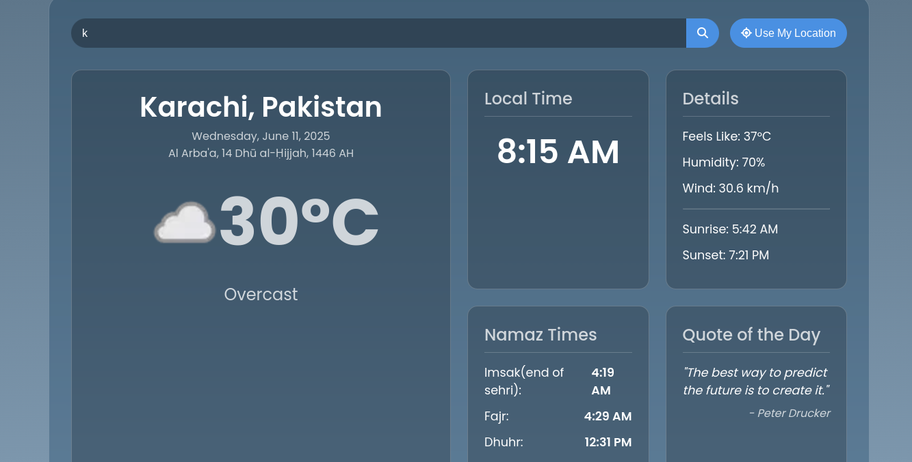

# AuraWeather - Your Personal Weather & Spiritual Companion

AuraWeather is a beautifully designed, all-in-one web application that serves as your daily hub for essential information. It combines real-time weather data, Islamic prayer times, and inspirational quotes, all set against a dynamic and soothing animated background that reflects the current weather conditions.

### [✨ View Live Demo Here ✨](https://your-demo-link.com) 
*(Replace with your actual live demo link after deployment)*




---

## 📋 Features

*   **Real-Time Weather:** Get current weather information for any city in the world, including temperature, weather description, "feels like" temperature, humidity, and wind speed.
*   **Dynamic Backgrounds:** The app's background is a beautiful, animated gradient that changes based on the weather (Clear, Clouds, Rain) and time of day (Day/Night).
*   **Islamic Prayer Times:** Automatically calculates and displays the five daily prayer times (Fajr, Dhuhr, Asr, Maghrib, Isha) plus Imsak, Sunrise, and Sunset times based on your location.
*   **Accurate Hijri Date:** Displays the current Islamic (Hijri) date, which intelligently adjusts after Maghrib prayer.
*   **Quote of the Day:** Start your day with an inspiring and motivational quote.
*   **Geolocation & Search:** Instantly get data for your current location with one click, or search for any city worldwide.
*   **Sleek, Modern UI:** A responsive, glassmorphism-style interface that is both beautiful and easy to use on any device.
*   **Persistent Location:** The app remembers your last searched location for a seamless experience on your next visit.

---

## 🛠️ Built With

*   **Frontend:** HTML5, CSS3, JavaScript (ES6+)
*   **APIs:**
    *   [WeatherAPI](https://www.weatherapi.com/) for comprehensive weather data.
    *   [Al-Adhan API](https://aladhan.com/prayer-times-api) for prayer times and Hijri calendar data.
    *   [Type.fit API](https://type.fit/api/quotes) for daily quotes.
*   **Icons:** [Font Awesome](https://fontawesome.com/)

---

## 🚀 Getting Started

To get a local copy up and running, follow these simple steps.

### Prerequisites

You need a modern web browser and API keys from the services listed below.

### Installation

1.  **Clone the repository:**
    ```sh
    git clone https://github.com/your-username/AuraWeather.git
    ```

2.  **Navigate to the project directory:**
    ```sh
    cd AuraWeather
    ```

3.  **Get your API Keys:**
    *   Sign up on [WeatherAPI.com](https://www.weatherapi.com/) to get a free API key.

4.  **Add your API Key to the script:**
    *   Open the `script.js` file.
    *   Find the following line and replace `'YOUR_API_KEY_HERE'` with the key you obtained:
        ```javascript
        const WEATHER_API_KEY = 'b190326769b84d12b01114742251006'; // Paste your key here
        ```
    *   The other APIs used in this project do not require keys.

5.  **Run the application:**
    *   Simply open the `index.html` file in your favorite web browser.

---

## 📄 License

Distributed under the MIT License. See `LICENSE` for more information.

---

## 🙏 Acknowledgments

*   A huge thank you to the providers of the free APIs that make this project possible:
    *   [WeatherAPI.com](https://www.weatherapi.com/)
    *   [AlAdhan.com](https://aladhan.com/prayer-times-api)
    *   [Type.fit](https://type.fit/api/quotes)
*   Font inspiration from [Google Fonts](https://fonts.google.com/).
*   Icons by [Font Awesome](https://fontawesome.com/).
